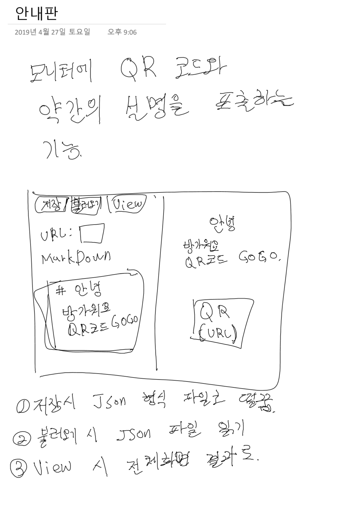
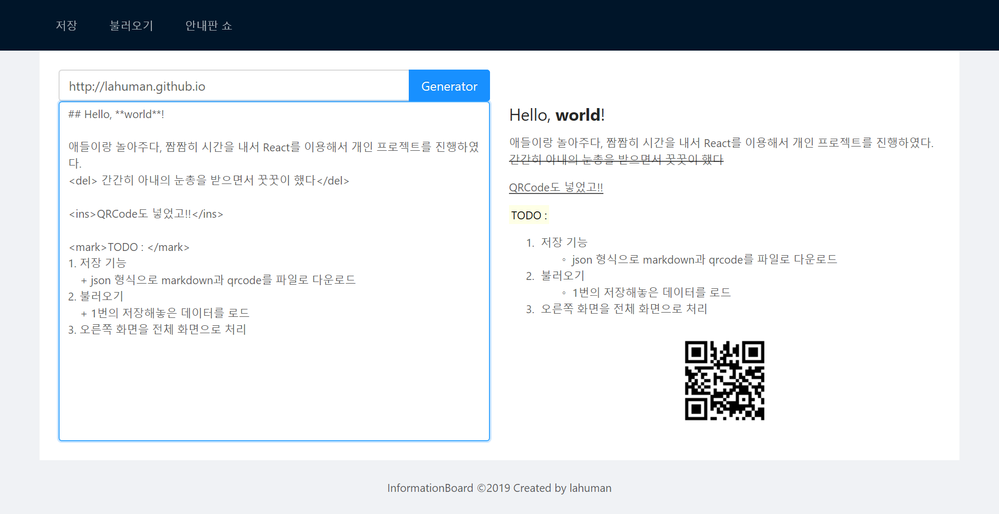

# 안내판

> 2019년 06월 16일 기능 개발 완료

기본 기능만 완료 했습니다. 제대로 사용하기 위해서는 조금더 추가해야 할 기능이 많네요.

## 실행 방법

### 안내서 Front 기동

```
$> npm i  //최초 1회 실행 필요
$> npm run start //서버 기동
```
3000 포트로 기동 되어 있습니다.
저장, 불러오기, 안내판쇼 기능을 구현 하였습니다.

### FILE UPLOAD를 위핸 SERVER 기동

```
$> cd server //서버 소스 위치
$> npm i  //최초 1회 실행 필요
$> npm run start //서버 기동
```

현재는 3001 port로 기동 되어 있습니다. 필요시 수정하셔요.




> 진행 중인 개인 프로젝트!!




애들이랑 놀아주다, 짬짬히 시간을 내서 React를 이용해서 개인 프로젝트를 진행하였다.
<del> 간간히 아내의 눈총을 받으면서 꿋꿋이 했다</del>

<ins>QRCode도 넣었고!!</ins>

<mark>TODO : 끝! </mark>
1. ~~저장 기능~~
    + json 형식으로 markdown과 qrcode를 파일로 다운로드 
2. ~~불러오기~~
    + 1번의 저장해놓은 데이터를 로드
3. ~~오른쪽 화면을 전체 화면으로 처리~~ 

